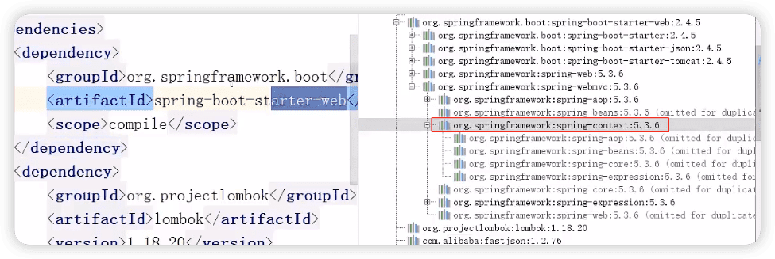
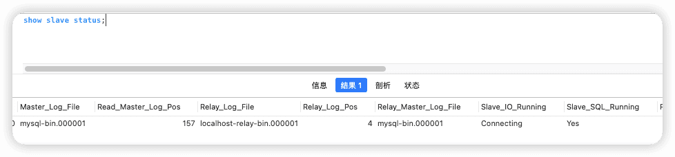
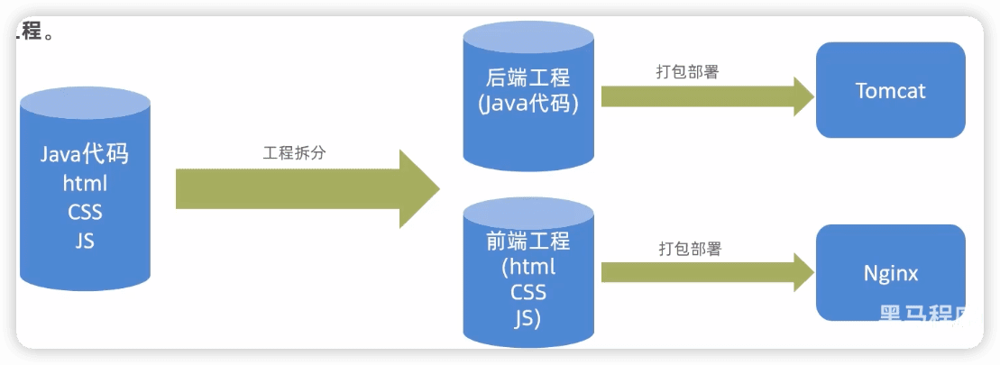

外卖
------

https://www.bilibili.com/video/BV13a411q753


> http://localhost:8080/backend/index.html
>
> http://localhost:8080/front/index.html

## 软件开发整体介绍

### 软件开发流程


### 角色分工

- 项目经理：对整个项目负责，任务分配、把控进度

- 产品经理：进行需求调研，输出需求调研文档、产品原型等

- UI设计师：根据产品原型输出界面效果图

- 架构师：项目整体架构设计、技术选型等

- 开发工程师：代码实现

- 测试工程师：编写测试用例，输出测试报告

- 运维工程师：软件环境搭建、项目上线

### 软件环境

- 开发环境(development)：开发人员在开发阶段使用的环境，一般外部用户无法访问

- 测试环境(testing)：专门给测试人员使用的环境，用于测试项目，一般外部用户无法访问

- 生产环境(production)：即线上环境，正式提供对外服务的环境

## 项目介绍

### 介绍

本项目是专门为餐饮企业(餐厅、饭店）定制的一款软件产品，包括系统管理后台和移动端应用两部分。

其中系统管理后台主要提供给餐饮企业内部员工使用，可以对餐厅的菜品、套餐、订单等进行管理维护。移动端应用

主要提供给消费者使用，可以在线浏览菜品、添加购物车、下单等。

本项目共分为3期进行开发：

第一期主要实现基本需求，其中移动端应用通过H5实现，用户可以通过手机浏览器访问。

第二期主要针对移动端应用进行改进，使用微信小程序实现，用户使用起来更加方便。

第三期主要针对系统进行优化升级，提高系统的访问性能。

### 产品原型

产品原型，就是一款产品成型之前的一个简单的框架，就是將页面的排版布局展现出来，使产品的初步构思有一个可视化的展示。通过原型展示，可以更加直观的了解项目的需求和提供的功能。

产品原型主要用于展示项目的功能，并不是最终的页面效果。

### 技术选型


### 功能架构


### 角色

- 后台系统管理员：登录后台管理系统，拥有后台系统中的所有操作板限
- 后台系统普通员工：登录后台管理系统，对菜品、套餐、订单等进行管理
- C端用户：登录移动端应用，可以浏览菜品、添加购物车、设置地址、在线下单等


## 开发环境搭建

### 数据库

数据表


项目名：artakeout


## 后台登录、退出

admin

123456


```js
this.$refs.loginForm.validate(async (valid) => {
  if (valid) {
    this.loading = true
    let res = await loginApi(this.loginForm)
    if (String(res.code) === '1') {
      localStorage.setItem('userInfo',JSON.stringify(res.data))
      window.location.href= '/backend/index.html'
    } else {
      this.$message.error(res.msg)
      this.loading = false
    }
  }
})
```


### 完善登录

还存在一个问题：用户如果不登录，直接访问系统首页面，照样可以正常访问。

这种设计并不合理，我们希望看到的效果应该是，只有登录成功后才可以访问系统中的页面，如果没有登录则跳转到登录页面。

那么，具体应该怎么实现呢？

答案就是使用**==过滤器或者拦截器==**，在过滤器或者拦截器中判断用户是否已经完成登录，如果没有登录则跳转到登录页面。

#### 实现步骤

1. 创建自定义过滤器`LoginCheckFiltter`
2. 在启动类上加入注解`@Servletcomponentscan`
3. 完善过滤器的处理逻辑

过滤器具体的处理逻辑如下：

1. 获取本次请求的URI
2. 判断本次请求是否需要处理
3. 如果不需要处理，则直接放行
4. 判断登录状态，如果已登录，则直接放行
5. 如果未登录则返回未登录结果


🔖 p18 浏览器js调试

## 员工管理

### 新增员工

employee表中对username字段加入了唯一约束，因为username是员工的登录账号，必须是唯一的。

梳理一下整个程序的执行过程：

1. 页面发送司ajax请求，将新增员工页面中输入的数据以json的形式提交到服务端
2. 服务端Controller接收页面提交的数据并调用Service将数据进行保存

3、service调用Mapper操作数据库，保存数据


前面的程序还存在一个问题，就是当我们在新增员工时输入的账号已经存在，由于employee表中对该宇段加入了唯一约束，此时程序会抛出异常：

```java
java.sql.SQLIntegrityConstraintViolationException: Duplicate entry ' zhangsan' for key ' idx_username
```

此时需要我们的程序进行异常捕获，通常有两种处理方式：

1. 在Controller方法中加入try、catch进行异常捕获

```java
try {
  employeeService.save(employeee);
} catch (Exception e) {
  R.error("新增员工失败");
}
return R.Success("新增员工成功");
```

2. 使用异常处理器进行全局异常捕获


#### 小结

1. 根据产品原型明确业务需求
2. 重点分析数据的流转过程和数据格式
3. 通过debug断点调试跟踪程序执行过程


### 员工信息分页查询

梳理一下整个程序的执行过程：

1. 页面发送ajax请求，将分页查询参数(page、pageSize、name)提交到服务端
2. 服务端Controller接收页面提交的数据并调用Service查询数据

3、Service调用Mapper操作数据库，查询分页数据

4、Controller将查询到的分页数据响应给页面

5、页面接收到分页数据并通过Elementul的Table组件展示到页面上


### 启用/禁用员工账号

#### 需求分析

在员工管理列表页面，可以对某个员工账号进行启用或者禁用操作。账号禁用的员工不能登录系统，启用后的员工可以正常登录。

需要注意，只有管理员 (admin用户）可以对其他普通用户进行启用、禁用操作，所以普通用户登录系统后启用、禁用按钮不显示。


#### 功能测试

测试过程中没有报错，但是功能并没有实现，查看数据库中的数据也没有变化。

观察控制台输出的SQL：


SQL执行的结果是更新的数据行数为0，仔细观察id的值，和数据库中对应记录的id值并不相同：


#### 代码修复

前面我们已经发现了问题的原因，即js对long型数据进行处理时丢失精度，导致提交的id和数据库中的id不一致。

如何解决这个问题？

我们可以在服务端给页面响应json数据时进行处理，将long型数据统一转为String字符串，效果如下：


具体实现步骤：

1. 提供对象转换器JacksonObjectMapper，基于jackson进行ava对象到ison数据的转换（资料中已经提供，直接复制到项目中使用）

2. 在WebMvcConfig配置类中扩展Spring mvc的消息转换器，在此消息转换器中使用提供的对象转换器进行ava对象到jison数据的转换

```java
@Configuration
public class WebMvcConfig extends WebMvcConfigurationSupport {
    /**
     * 扩展MVC框架的消息转换器
     * @param converters
     */
    @Override
    protected void extendMessageConverters(List<HttpMessageConverter<?>> converters) {
        log.info("扩展消息转换器....");
        // 创建消息转换器对象
        MappingJackson2HttpMessageConverter messageConverter = new MappingJackson2HttpMessageConverter();
        // 设置对象转换器，底层使用Jackson将Java对象转为json
        messageConverter.setObjectMapper(new JacksonObjectMapper());
        // 将消息转换器对象追加到mvc框架的转换器集合中（放在第一位）
        converters.add(0, messageConverter);
    }
}
```


### 编辑员工信息

梳理一下操作过程和对应的程序的执行流程：

1. 点击编辑按钮时，页面跳转到add.html，并在url中携带参数[员工id]
2. 在add.htm页面获取url中的参数[员工id]

3. 发送ajax请求，请求服务端，同时提交员工id参数
4. 服务端接收请求，根据员工id查询员工信息，将员工信息以json形式响应给页面
5. 页面接收服务端响应的json数据，通过VUE的数据绑定进行员工信息回显
6. 点击保存按钮，发送ajax请求，将页面中的员工信息以json方式提交给服务端
7. 服务端接收员工信息，并进行处理，完成后给页面响应
8. 页面接收到服务端响应信息后进行相应处理

> 注意：add.html页面为公共页面，新增员工和编辑员工都是在此页面操作

## 分类管理

### 公共字段自动填充

#### 问题分析

前面我们已经完成了后台系统的员工管理功能开发，在新增员工时需要设置创建时问、创建人、修改时问、修改人等字段，在编辑员工时需要设置修改时问和修改人等宇段。这些字段属于公共字段，也就是很多表中都有这些字段。


使用Mybatis Plus提供的公共字段自动填充功能，来对于这些公共字段在某个地方统一处理，来简化开发。

#### 代码实现

Mybatis Plus公共字段自动填充，也就是在插入或者更新的时候为指定字段赋予指定的值，使用它的好处就是可以统一对这些字段进行处理，避免了重复代码。

实现步骤：

1. 在实体类的属性 上加入`@TableField`注解，指定自动填充的策略

2. 按照框架要求编写元数据对象处理器，在此类中统一为公共字段赋值，此类需要实现`MetaObjectHandler`接口


#### 功能完善

前面我们已经完成了公共字段自动填充功能的代码开发，但是还有一个问题没有解决，就是我们在自动填充createUser和updateuser时设置的用户id是固定值，现在我们需要改造成动态获取当前登录用户的id。

有的同学可能想到，用户登录成功后我们将用户id存入了HttpSession中，现在我从Httpsession中获取不就行了？

注意，我们在MyMetaObjectHandler类中是不能获得HttpSession对象的，所以我们需要通过其他方式来获取登录用户id。

可以使用ThreadLocal来解决此问题，它是JDK中提供的一个类。


在学习Threadlocal之前，我们需要先确认一个事情，就是客户端发送的每次http请求，对应的在服务端都会分配一个新的线程来处理，在处理过程中涉及到下面类中的方法都属于相同的一个线程：

1. LoginCheckFilter的doFilter方法

2. EmployeeController的update方法

3. MyMetaObjectHandler的updateFill方法

可以在上面的三个方法中分别加入下面代码(获取当前线程id）：

```java
log.info("线程id：{}", Thread.currentThread().getId());
```

执行编辑员工功能进行验证，通过观察控制台输出可以发现，一次请求对应的线程id是相同的。


##### 什么是ThreadLocal?

ThreadLocal并不是一个Thread，而是==Thread的局部变量==。当使用ThreadLocal维护变量时，ThreadLocal为每个使用该变量的线程提供独立的变量副本，所以每一个线程都可以独立地改变自己的副本，而不会影响其它线程所对应的副本。

ThreadLocal 为每个线程提供单独一份存储空间，具有**线程隔离**的效果，只有在线程内才能获取到对应的值，线程外则不能访问。

ThreadLocal常用方法：

- `public void set(T value）` 设置当前线程的线程局部变量的值
- `public T get()`  返回当前线程所对应的线程局部变量的值

我们可以在LoginCheckFilter的doFilter方法中获取当前登录用户id，并调用ThreadLocal的set方法来设置当前线程的线程局部变量的值（用户id），然后在MyMetaObjectHandler的updateFill方法中调用ThreadLocal的get方法来获得当前线程所对应的线程局部变量的值（用户id）。

##### 实现步骤：

1. 编写BaseContext工具类，基于ThreadLocal封装的工具类
2. 在LoginCheckFilter的doFilter方法中调用BaseContext来设置当前登录用户的id
3. 在MyMetaObjectHandler的方法中调用BaseContext获取登录用户的id


### 新增分类

后台系统中可以管理分类信息，分类包括两种类型，分别是菜品分类和套餐分类。当我们在后台系统中添加菜品时需要选择一个菜品分类，当我们在后台系统中添加一个套餐时需要选择一个套餐分类，在移动端也会按照菜品分类和套餐分类来展示对应的菜品和套餐。

在开发业务功能前，先将需要用到的类和接口基本结构创建好：

- 实体类Category
- Mapper接口 CategoryMapper
- 业务层接口 Categoryservice
- 业务层实现类Category Servicelmpl
- 控制层Categorycontroler

梳理一下整个程序的执行过程：

1. 页面(backend/page/category/list.html)发送ajax清求，将新増分类窗口输入的数据以json形式提交到服多端
2. 服务端Controller接收页面提交的数据并调用Service将数据进行保存

3. Service凋用Mapper操作数据库，保存数据

可以看到新增菜品分类和新增套餐分类请求的服务端地址和提交的json数据结构相同，所以服务端只需要提供一个方法统一处理即可。

### 分类信息分析查询


### 删除分类


要完善分类删除功能，需要先准备基础的类和接口：

1. 实体类Dish和Setmeal
2. Mapper接口DishMapper和 SetmealMapper
3. Service接口DishService和 Setmealservice
4. Service实现类 DishServicelmpl和SetmealServicelmpl


🔖 后面调试部分


### 修改分类


## 菜品管理

🔖 起售、停售


### 文件上传下载

#### 文件上传介绍

文件上传，也称为upload，是指将本地图片、视频、音频等文件 上传到服务器上，可以供其他用户浏览或下载的过程。

文件上传在项目中应用非常广泛，我们经常发微博、发微信朋友圈都用到了文件上传功能。

文件上传时，对页面的form表单有如下要求：

-  method="post"  采用post方式提交数据

- enctype="multipart/form-data"   采用multipart格式上传文件
- type="file"  使用input的file控件上传


服务端要接收客户端页面上传的文件，通常都会使用Apache的两个组件：

- commons-fileupload
- commons-io

Spring框架在Spring-web包中对文件上传进行了封装，大大简化了服务端代码，我们只需要在Controller的方法中声明一个`MultipartFile`类型的参数即可接收上传的文件。

#### 文件下载介绍

文件下载，也称为download，是指将文件从服务器传输到本地计算机的过程。

通过浏览器进行文件下载，通常有两种表现形式：

- 以附件形式下载，弹出保存对话框，将文件保存到指定磁盘目录
- 直接在浏览器中打开

通过浏览器进行文件下载，本质上就是服务端将文件以流的形式写回浏览器的过程。


### 新增菜品

新增菜品，其实就是将新增页面录入的菜品信息插入到dish表，如果添加了口味做法，还需要向dish_ flavor表插入数据。

所以在新增菜品时，涉及到两个表：

- dish菜品表

- dish flavor 菜品口味表

在开发业务功能前，先将需要用到的类和接口基本结构创建好：

- 实体类 DishFlavor
- Mapper接口 DishFlavorMapper
- 业务层接口 DishFlavorService
- 业务层实现类 DishFlavorservicelmpl
- 控制层 DishController

梳理一下新增菜品时前端页面和服务端的交互过程：

1. 页面(backend/ page/food/add.html)发送ajax请求，请求服务端获取菜品分类数据并展示到下拉框中
2. 页面发送请求进行图片上传，请求服务端将图片保存到服务器
3. 页面发送请求进行圈片下载，將上传的图片进行回显
4. 点击保存按钮，发送司jax请求，将菜品相关数据以json形式提交到服务端

开发新增菜品功能，其实就是在服务端编写代码去处理前端页面发送的这4次请求即可。


#### 代码开发DTO

DTO，全称为Data Transfer object，即数据传输对象，一般用于展示层与服务层之问的数据传输。

DishDto用于封装页面提交的数据：

```java
@Data
public class DishDto extends Dish {
    private List<DishFlavor> flavors = new ArrayList<>();
    private String categoryName;
    private Integer copies;
}
```


```json
{
    "name": "xxx",
    "price": 2000,
    "code": "",
    "image": "452743c7-0270-4db2-86b3-4a6ccc498444.jpg",
    "description": "打卡积分时代峰峻阿萨德飞机阿萨",
    "status": 1,
    "categoryId": "1397844303408574465",
    "flavors": [
        {
            "name": "温度",
            "value": "[\"热饮\",\"常温\",\"去冰\",\"少冰\",\"多冰\"]",
            "showOption": false
        },
        {
            "name": "忌口",
            "value": "[\"不要葱\",\"不要蒜\",\"不要香菜\",\"不要辣\"]",
            "showOption": false
        },
        {
            "name": "温度",
            "value": "[\"热饮\",\"常温\",\"去冰\",\"少冰\",\"多冰\"]",
            "showOption": false
        },
        {
            "name": "辣度",
            "value": "[\"不辣\",\"微辣\",\"中辣\",\"重辣\"]",
            "showOption": false
        }
    ]
}
```


### 菜品信息分页查询

🔖  一个页面好多请求，影响效率吗？怎么改进


### 修改菜品

梳理一下修改菜品时前端页面（add.html）和服务端的交互过程：

1. 页面发送ajax请求，请求服务端获取分类数据，用于菜品分类下拉框中数据展示
2. 页面发送ajax请求，请求服务端，根据id查询当前菜品信息，用于菜品信息回显
3. 页面发送请求，请求服务端进行图片下载，用于页图片回显
4. 点击保存按钮，页面发送ajax请求，将修改后的菜品相关数据以son形式提交到服务端

开发修改菜品功能，其实就是在服务端编写代码去处理前端页面发送的这4次请求即可。


## 套餐管理

🔖 修改 停售 启售

### 新增套餐

#### 需求分析

套餐就是菜品的集合。

后台系统中可以管理套餐信息，通过新增套餐功能来添加一个新的套餐，在添加套餐时需要选择当前套餐所属的套餐分类和包含的菜品，并且需要上传套餐对应的图片，在移动端会按照套餐分类来展示对应的套餐。


#### 数据模型

新增套餐，其实就是将新增页面录入的套餐信息插入到setmeal表，还需要向setmeal_dish表插入套餐和菜品关联数据。

所以在新增套餐时，涉及到两个表：

- setmeal  套餐表

- setmeal_dish  套餐菜品关系表

#### 代码开发

基本类和接口基本结构创建好：

- 实体类 SetmealDish
- DTO SetmealDto
- Mapper接口 SetmealDishMapper
- 业务层接口 SetmealDishservice
- 业务层实现类 SetmealDishServicelmpl
- 控制层 Setmealcontroller

梳理一下新增套餐时前端页面和服务端的交互过程：

1. 页面(backend/page/combo/add.html)发送ajax请求，请求服务端获取套餐分类数据并展示到下拉框中
2. 页面发送ajax请求，请求服务端获取菜品分类数据并展示到添加菜品窗口中
3. 页面发送ajax请求，请求服务端，根据菜品分类查询对应的菜品数据并展示到添加菜品窗口中
4. 页面发送请求进行国片上传，请求服务端将图片保存到服务器
5. 页面发送请求进行图片下载，将上传的图片进行回显
6. 点击保存按钮，发送ajax请求，将套餐相关数据以json形式提交到服务端

开发新增套餐功能，其实就是在服务端编写代码去处理前端页面发送的这6次请求即可。


### 套餐信息分页查询


### 删除套餐

在套餐管理列表页面点击删除按钮，可以删除对应的套餐信息。也可以通过复选框选择多个套餐，点击批量删除按钮一次删除多个套餐。注意，<u>对于状态为售卖中的套餐不能删除，需要先停售，然后才能删除。</u>

梳理一下删除套餐时前端页面和服务端的交互过程：

1. 删除单个套餐时，页面发送aiax请求，根据套餐id删除对应套餐

   ```
   http://localhost:8080/setmeal?ids=1641895881319911426
   ```

2. 删除多个套餐时，页面发送ajax请求，根据提交的多个套餐id删除对应套餐

   ```
   http://localhost:8080/setmeal?ids=1641895881319911426,1641894824430817282,1641894421857325058
   ```

开发删除套餐功能，其实就是在服务端编写代码去处理前端页面发送的这2次请求即可。

删除单个套餐和批量删除套餐请求的地址和请求方式都是相同的，不同的则是传递的id个数，所以在服务端可以提供一个方法来统一处理。


## 手机验证码登录

### 短信发送

#### 短信服务介绍

目前市面上有很多第三方提供的短信服务，这些第三方短信服务会和各个运营商 （移动、联通、电信）对接，我们只需要注册成为会员并且按照提供的开发文档进行调用就可以发送短信。需要说明的是，这些短信服务一般都是收费服务。

常用短信服务：

- 阿里云

- 华为云

- 腾讯云
- 京东
- 梦网
- 乐信

#### 阿里云短信服务介绍

阿里云短信服务(Short Message Service，==SMS==）是广大企业客户快速触达手机用户所优选使用的通信能力。调用API或用群发助手，即可发送验证码、通知类和营销类短信；国内验证短信秘级触达，到达率最高可达99%；国际/港澳台短信覆盖200多个国家和地区，安全稳定，广受出海企业选用。

应用场景：

- 验证码。

- 短信通知
- 推广短信

https://www.aliyun.com/product/sms

🔖P82 阿里云控制台的一些操作


设置短信签名

短信签名是短信发送者的署名，表示发送方的身份。


设置短信模版


```xml
	<!-- 阿里云SMS -->
    <dependency>
      <groupId>com.aliyun</groupId>
      <artifactId>aliyun-java-sdk-core</artifactId>
      <version>4.5.16</version>
    </dependency>
    <dependency>
      <groupId>com.aliyun</groupId>
      <artifactId>aliyun-java-sdk-dysmsapi</artifactId>
      <version>2.1.0</version>
    </dependency>
```


### 开发

#### 需求分析

为了方便用户登录，移动端通常都会提供通过手机验证码登录的功能。

手机验证码登录的优点：

- 方便快捷，无需注册，直接登录
- 使用短信验证码作为登录凭证，无需记忆密码

- 安全

登录流程：

```
输入手机号>获取验证码>输入验证码>点击登录>登录成功
```

注意：通过手机验证码登录，手机号是区分不同用户的标识。


梳理一下登录时前端页面和服务端的交互过程：

1. 在登录页面(front/page/login.html)输入手机号，点击【获取验证码】按钮，页面发送司jax请求，在服务端调用短信服务API给指定手机号发送验证码短信

2. 在登录页面输入验证码，点击【登录】按钮，发送司jax请求，在服务端处理登录请求

开发手机验证码登录功能，其实就是在服务端编马代码去处理前端页面发送的这2次请求即可。


🔖 阿里sms 的key

## 菜品展示、购物车、下单

导入用户地址簿相关功能

### 菜品展示

#### 需求分析

用户登录成功后跳转到系统首页，在首页需要根据分类来展示菜品和套餐。如果菜品设置了口味信息，需要展示 **选择观格** 按钮，否则显示 **+**按钮。


梳理一下前端页面和服务端的交互过程：

1. 页面(front/index.html)发送司jax请求，获取分类数据（菜品分类和套餐分类）

2. 页面发送ajax请求，获取第一个分类下的菜品或者套餐

开发菜品展示功能，其实就是在服务端编写代码去处理前端页面发送的这2次请求即可。


### 购物车

#### 需求分析

移动端用户可以将菜品或者套餐添加到购物车。对于菜品来说，如果设置了口味信息，则需要选择规格后才能加入购物车;对于套餐来说，可以直接点击 + 将当前套餐加入购物车。在购物车中可以修改菜品和套餐的数量，也可以清空购物车。


梳理一下购物车操作时前端页面和服务端的交互过程：

1. 点击【加入购物车】或者 + 按钮，页面发送司jax请求，请求服务端，将菜品或者套餐添加到购物车

2. 点击购物车图标，页面发送ajax请求，请求服务端查询购物车中的莱品和套餐

3. 点击清空购物车按钮，页面发送ajax请求，请求服务端来执行清空购物车操作

### 用户下单

梳理一下用户下单操作时前端页面和服务端的交互过程：

1. 在购物车中点击【去结算】 按钮，页面跳转到订单确认页面
2. 在订单确认页面，发送ajax请求，请求服务端获取当前登录用户的默认地址
3. 在订单确认页面，发送ajax请求，请求服务端获取当前登录用户的购物车数据
4. 在订单确认页面点击【去支付】按钮，发送司jax请求，请求服务端完成下单操作


## Git

## Linux 

### 项目部署

#### 手工部署项目

#### 通过shell脚本自动部署项目


## Redis课程


----

优化

## 缓存优化

### 缓存环境搭建


### 缓存短信验证码

#### 实现思路

前面我们己经实现了移动端手机验证码登录，随机生成的验证码我们是保存在HttpSession中的。

现在需要改造为將验证码缓存在Redis中，具体的实现思路如下：

1. 在服务端Usercontroller中注入RedisTemplate对象，用于操作Redis
2. 在服务端UserController的sencMsg方法中，将随机生成的验证码缓存到Redis中，并设置有效期为5分钟
3. 在服务端Usercontroller的login方法中，从Redis中获取缓存的验证码，如果登录成功则删除Redis中的验证码

```xml
    <dependency>
      <groupId>org.springframework.boot</groupId>
      <artifactId>spring-boot-starter-data-redis</artifactId>
    </dependency>
```


```java
            // 验证码保存到session
//            session.setAttribute(phone, code);
            // 验证保存到Redis，设置有效期5min
            redisTemplate.opsForValue().set(phone, code, 5, TimeUnit.MINUTES);
```

```java
        // 从session中获取保存的验证码
//        Object codeInSession = session.getAttribute(phone);
        // 从Redis获取缓存的验证码
        Object codeInSession = redisTemplate.opsForValue().get(phone);
```

```java
            // 用户登录成功，删除Redis中缓存的验证码
            redisTemplate.delete(phone);
```


### 缓存菜品数据

#### 实现思路

前面我们已经实现了移动端菜品查看功能，对应的服务端方法为DishController的list方法，此方法会根据前端提交的查询条件进行数据库查询操作。在高并发的情况下，频繁查询数据库会导致系统性能下降，服务端响应时间增长。现在需要对此方法进行缓存优化，提高系统的性能。

具体的实现思路如下：

1. 改造Dishcontroller的list方法，先从Redis中获取菜品数据，如果有则直接返回，无需查询数据库;如果没有则查询数据库，并将查询到的菜品数据放入Redis。
2. 改造Dishcontroller的save 和update方法，加入清理缓存的逻辑

> 注意：在使用缓存过程中，要注意**保证数据库中的数据和缓存中的数据一致**，如果数据库中的数据发生变化，需要及时清理缓存数据。

```java
// 动态构造Redis的key
String key = "dish_" + dish.getCategoryId() + "_" + dish.getStatus();
dishDtoList = (List<DishDto>) redisTemplate.opsForValue().get(key);
if (dishDtoList != null) {
  // 缓存中存在，就直接返回，不用查数据库
  return R.success(dishDtoList);
}

// ...

// 查询的心数据做缓存
redisTemplate.opsForValue().set(key, dishDtoList, 60, TimeUnit.MINUTES);

```


```java
// 清理对应分类下的菜品缓存数据
String key = "dish_" + dishDto.getCategoryId() + "_1";
redisTemplate.delete(key);
```


### Spring Cache

简化使用缓存的方式。只需要简单的几个注解。

##### 介绍

Spring Cache是一个框架，实现了基于==注解==的缓存功能，只需要简单地加一个注解，就能实现缓存功能。

Spring Cache提供了一层抽象，底层可以切换不同的cache实现。具体就是通过`CacheManager`接口来统一不同的缓存技术。

CacheManager是Spring提供的各种缓存技术抽象接口。

针对不同的缓存技术需要实现不同的CacheManager：


##### Spring Cache常用注解


- `@EnableCaching`，开启缓存注解功能，使用在启动类上。

- `@Cacheable`，在方法执行前spring先查看缓存中是否有数据，如果有数据，则直接返回缓存数据;若没有数据，调用方法并将方法返回值放到缓存中。【==查询==】

- `@CachePut`，将方法的返回值放到缓存中，一般用在==新增==方法上。

- `@CacheEvict`，将一条或多条数据从缓存中删除。【==删除、更新==】时都删除缓存


在spring boot项目中，使用缓存技术只需在项目中导入相关缓存技术的依赖包，并在启动类上使用`@EnableCaching`开启缓存支持即可。

例如，使用Redis作为缓存技术，只需要导入Spring data Redis的maven坐标即可。

**pom文件中导入是哪个缓存，Spring Cache就使用那个缓存技术。**


Spring Cache的基础功能在springweb的**spring-context**包内，不需要再另外导入包了：



`ConcurrentMapCacheManager`是`CacheManager`接口的基础实现，其使用`ConcurrentMap`为基础实现缓存的。


#### 测试项目【cache_demo】

**SpEL**

```java
@RestController
@RequestMapping("/user")
@Slf4j
public class UserController {

    @Autowired
    private CacheManager cacheManager;

    @Autowired
    private UserService userService;

    /**
     * CachePut：将方法返回值放入缓存
     * value：缓存的名称，每个缓存名称下面可以有多个key，相当于某一类缓存
     * key：缓存的key   SpEL
     */
    @CachePut(value = "userCache", key = "#user.id")
    @PostMapping
    public User save(User user){ // 没有@RequestBody，不需要JSON数据，提交普通的表单数据就可以
        userService.save(user);
        return user;
    }

    /**
     * CacheEvict：清理指定缓存
     * value：缓存的名称，每个缓存名称下面可以有多个key
     * key：缓存的key
     *  第一个参数的几种写法 #p0 #root.args[0] #id
     */
    @CacheEvict(value = "userCache", key = "#p0")  // 0是参数位置
    //@CacheEvict(value = "userCache",key = "#root.args[0]")
    //@CacheEvict(value = "userCache",key = "#id")  // 要和形参名相同
    @DeleteMapping("/{id}")
    public void delete(@PathVariable Long id){
        userService.removeById(id);
    }

    //@CacheEvict(value = "userCache",key = "#p0.id")
    //@CacheEvict(value = "userCache",key = "#user.id")
    //@CacheEvict(value = "userCache",key = "#root.args[0].id")
    @CacheEvict(value = "userCache", key = "#result.id") // 更新时也删除缓存
    @PutMapping
    public User update(User user){
        userService.updateById(user);
        return user;
    }

    /**
     * Cacheable：在方法执行前spring先查看缓存中是否有数据，如果有数据，则直接返回缓存数据；若没有数据，调用方法并将方法返回值放到缓存中
     * value：缓存的名称，每个缓存名称下面可以有多个key
     * key：缓存的key
     * condition：条件，满足条件时才缓存数据
     * unless：满足条件则不缓存
     */
    @Cacheable(value = "userCache", key = "#id", unless = "#result == null")
    @GetMapping("/{id}")
    public User getById(@PathVariable Long id){
        User user = userService.getById(id);
        return user;
    }

    /**
     * 条件查询情况
     * 不同的条件，对应不同的key
     */
    @Cacheable(value = "userCache",key = "#user.id + '_' + #user.name")
    @GetMapping("/list")
    public List<User> list(User user){
        LambdaQueryWrapper<User> queryWrapper = new LambdaQueryWrapper<>();
        queryWrapper.eq(user.getId() != null, User::getId,user.getId());
        queryWrapper.eq(user.getName() != null, User::getName,user.getName());
        List<User> list = userService.list(queryWrapper);
        return list;
    }
}
```

##### 改用redis做缓存

在Spring Boot项目中使用Spring Cache的操作步骤(使用redis缓存技术）：

1. 导入maven坐标
    spring-boot-starter-data-redis, spring-boot-starter-cache

    ```xml
    <dependency>
      <groupId>org.springframework.boot</groupId>
      <artifactId>spring-boot-starter-cache</artifactId>
    </dependency>
    
    <dependency>
      <groupId>org.springframework.boot</groupId>
      <artifactId>spring-boot-starter-data-redis</artifactId>
    </dependency>
    ```
    
    
    
2. 配置application.yml

   ```yaml
     redis:
       host: 127.0.01
       port: 6379
       password:
       database: 0
     cache:
       redis:
         time-to-live: 1800000 # 设置缓存过期时间，可选
   ```

   

3. 在启动类上加入`@EnableCaching`注解，开启缓存注解功能

4. 在controller的方法上加入@Cacheable、@CacheEvict等注解，进行缓存操作


### 使用Spring Cache缓存套餐数据

#### 实现思路

前面我们已经实现了移动端套餐查看功能，对应的服务端方法为Setmealcontroller的list方法，此方法会根据前端提袁的查询条件进行数据库查询操作。在高并发的情况下，频繁查询数据库会导致系统性能下降，服务端响应时间增长。

现在需要对此方法进行缓存优化，提高系统的性能。

具体的实现思路如下：

1. 导入Spring Cache和Redis相关maven坐标
2. 在application.yml中配置缓存数据的过期时间
3. 在启动类上加入@EnableCaching注解，开启缓存注解功能
4. 在Setmealcontroller的list方法上加入@Cacheable注解
5. 在Setmealcontroller的save和delete方法上加入CacheEvict注解


注意把返回结果`R`继承序列化，因为缓存时要把结果序列化

报错：

```java
java.lang.IllegalArgumentException: DefaultSerializer requires a Serializable payload but received an object of type [com.andyron.takeout.common.R]
```


## MySQL主从复制

读写分离


### mysql主从复制介绍

mysql主从复制是一个异步的复制过程，底层是基于mysql数据库自带的==二进制日志==功能。就是一台或多台MySQL数据库(slave，即从库）从另一台MySQL数据库（master，，即主库）进行日志的复制然后再解析日志并应用到自身，最终实现从库的数据和主库的数据保持一致。MysQL主从复制是MySQL 数据库自带功能，无需借助第三方工具。

MySQL复制过程分成三步：

- master將改变记录到二进制日志 (binary log)
- slave将master的binary log拷贝到它的==中继日志== (relay log）
- slave重做中继日志中的事件，将改变应用到自己的数据库中


主库一个，从库多个

### 实现mysql主从复制

#### 配置-前置条件

提前准备好两台服务器，分别安装Mysql并启动服务成功

- 主库Master  10.211.55.5
- 从库Slave   10.211.55.6

#### 配置-主库Master

第一步：修改Mysql数据库的配置文件/etc/my.cnf

```mysql
[mysqldl]
log-bin=mysql-bin #[必须]启用二进制日志
server-id=100  	#[必须]服务器唯一ID
```

第二步：

```shell
systemcl restart mysqld
```

第三步：登录Mysql数据库，执行下面SQL

```mysql
GRANT REPLICATION SLAVE ON *.* to 'xiaoming'@'%' identified by 'Root@123456';
```

mysql8，需要先创建用户，再赋权：

```mysql
create user 'xiaoming'@'%' identified by 'Root@123456';
Grant REPLICATION SlAVE ON *.* to 'xiaoming'@'%';
-------

create user 'xiaoming2'@'%' identified WITH 'mysql_native_password' by 'Root@123456';
Grant REPLICATION SlAVE ON *.* to 'xiaoming2'@'%';
FLUSH PRIVILEGES;
```


注：上面SQL的作用是创建一个用户xiaoming，密码为Root@123456，并且给xiaoming用户授予**REPLICATION SLAVE** 权限。常用于建立复制时所需要用到的用户权限，也就是slave必须被master授权具有该权限的用户，才能通过该用户复制。

第四步：登录Mysql数据库，执行下面SQL，记录下结果中**File**和**Position**的值`show master status;`

```shell
mysql> show master status;
+------------------+----------+--------------+------------------+-------------------+
| File             | Position | Binlog_Do_DB | Binlog_Ignore_DB | Executed_Gtid_Set |
+------------------+----------+--------------+------------------+-------------------+
| mysql-bin.000001 |      691 |              |                  |                   |
+------------------+----------+--------------+------------------+-------------------+
1 row in set (0.01 sec)
```

注：上面SQL的作用是查看Master的状态，执行完此SQL后不要再执行任何操作


#### 配置-从库Slave

第一步：修改Mysql数据库的配置文件/etc/my.cnf

```mysql
[mysqld]
server-id=101 #[必须]服务器唯一ID
```

第二步：重启

第三步：执行sql：

```mysql
CHANGE MASTER TO master_host='10.211.55.5', master_user='xiaoming', master_password='Root@123456', master_log_file='mysql-bin.000001', master_log_pos=691;

start slave;


CHANGE MASTER TO master_host='10.211.55.5', master_user='xiaoming2', master_password='Root@123456', master_log_file='mysql-bin.000001', master_log_pos=1580;
```


```mysql
stop slave;
```


第四步：查看从数据库的状态

```mysql
show slave status;
```



```mysql
show slave status \G;
```

查看错误字段：

```
Last_IO_Errno: 2061
Last_IO_Error: error connecting to master 'xiaoming@10.211.55.5:3306' - retry-time: 60 retries: 6 message: Authentication plugin 'caching_sha2_password' reported error: Authentication requires secure connection.
```

>  🔖解决https://blog.csdn.net/wawa8899/article/details/86689618
>
> MySQL8.0默认指定使用需要SSL的身份验证插件caching_sha2_password，而我们在创建同步复制账号时候没有指定REQUIRE SSL。为了降低这件事情的复杂性，我们选择了社区的解决方法，选择绕过SSL插件的验证，改为mysql_native_password验证来做同步复制。

> 虚拟机休眠后（第二天，session断开重连后），需要重现更改master_log_pos
>
> ```mysql
> stop slave;
> CHANGE MASTER TO master_host='10.211.55.5', master_user='xiaoming2', master_password='Root@123456', master_log_file='mysql-bin.000001', master_log_pos=xxxx;
> start slave;
> ```
>
> 否则出现类似错误：
>
> ```
> Last_SQL_Errno: 1049
> Last_SQL_Error: Coordinator stopped because there were error(s) in the worker(s). The most recent failure being: Worker 1 failed executing transaction 'ANONYMOUS' at master log mysql-bin.000001, end_log_pos 22
> ```
>
> 


### 读写分离案例

#### 背景

面对日益增加的系统访问量，数据库的吞吐量面临着巨大瓶颈。对于同一时刻有大量并发读操作和较少写操作类型的应用系统来说，将数据库拆分为主库和从库，主库负责处理事务性的增删改操作，从库负责处理查询操作，能够有效的避免由数据更新导致的行锁，使得整个系统的查询性能得到极大的改善。


#### Sharding-JDBC介绍

Sharding-JDBC定位为轻量级ava框架，在Java的JDBC层提供的额外服务。它使用客户端直连数据库，以jar包形式提供服务，无需额外部署和依赖，可理解为增强版的JDBC驱动，完全兼容JDBC和各种ORM框架。

使用Sharding-JDBC可以在程序中轻松的实现数据库读写分离。

- 适用于任何基于JDBC的ORM框架，如：JPA, Hibernate, Mybatis, Spring JDBC Template或直接使用JDBC。
- 支持任何第三方的数据库连接池，如：DBCP, C3P0, BoneCP, Druid, HikariCP等。
- 支持任意实现JDBC规范的数据库。目前支持MysQL, Oracle, SQLServer， PostgresQL以及任何遵循SQL92标准的数据库。

### 入门案例

使用Sharding-JDBC实现读写分离步骤：

1. 导入maven坐标

```xml
    <dependency>
      <groupId>org.apache.shardingsphere</groupId>
      <artifactId>sharding-jdbc-spring-boot-starter</artifactId>
      <version>4.0.0-RC1</version>
    </dependency>
```


2. 在配置文件中配置读写分离规则

```yaml
server:
  port: 8080
mybatis-plus:
  configuration:
    map-underscore-to-camel-case: true
    log-impl: org.apache.ibatis.logging.stdout.StdOutImpl
  global-config:
    db-config:
      id-type: ASSIGN_ID
spring:
  shardingsphere:
    datasource:
      names:
        master,slave
    master:
      type: com.alibaba.druid.pool.DruidDataSource
      driver-class-name: com.mysql.cj.jdbc.Driver
      url: jdbc:mysql://10.211.55.5:3306/rw?serverTimezone=Asia/Shanghai&useUnicode=true&characterEncoding=utf-8&zeroDateTimeBehavior=convertToNull&useSSL=false&allowPublicKeyRetrieval=true
      username: root
      password: 33824
    slave:
      type: com.alibaba.druid.pool.DruidDataSource
      driver-class-name: com.mysql.cj.jdbc.Driver
      url: jdbc:mysql://10.211.55.6:3306/rw?serverTimezone=Asia/Shanghai&useUnicode=true&characterEncoding=utf-8&zeroDateTimeBehavior=convertToNull&useSSL=false&allowPublicKeyRetrieval=true
      username: root
      password: 33824
    masterslave:
      # 读写分离 负载均衡配置，round_robin为轮询
      load-balance-algorithm-type: round_robin
      # 最终的数据源名称
      name: dataSource
      # 主库数据源名称
      master-data-source-name: master
      # 从库数据源名称列表，多个用逗号隔开
      slave-data-source-names: slave
    props:
      sql:
        show: true  # 在控制台开启SQL显示
```


3. 在配置文件中配置**允许bean定义覆盖**配置项

错误：

```
Description:

The bean 'dataSource', defined in class path resource [org/apache/shardingsphere/shardingjdbc/spring/boot/SpringBootConfiguration.class], could not be registered. A bean with that name has already been defined in class path resource [com/alibaba/druid/spring/boot/autoconfigure/DruidDataSourceAutoConfigure.class] and overriding is disabled.

Action:

Consider renaming one of the beans or enabling overriding by setting spring.main.allow-bean-definition-overriding=true

```

原因是`SpringBootConfiguration`和`DruidDataSourceAutoConfigure`都配置了数据源，冲突了。

需要配置允许覆盖

```yaml
spring:
  main:
    # 允许bean定义覆盖Spring的，DruidDataSourceAutoConfigure覆盖SpringBootConfiguration的中数据源
    allow-bean-definition-overriding: true
```

🔖报错

```
```

### 项目中实现读写分离

🔖


## Nginx

### 概述

#### Nginx介绍

Nginx是一款轻量级的web服务器/ 反向代理服务器及电子邮件（IMAP/ POP3） 代理服务器。其特点是占有内存少，并发能力强，事实上nginx的井发能力在同类型的网页服务器中表现较好，中国大陆使用nginx的网站有：百度、京东、新浪、网易、騰讯、淘宝等。

Nginx是由伊戈尔•赛索耶夫为俄罗斯访问量第二的Rambler.ru站点（俄文：PamGnep）开发的，第一个公开版本8.1.0发布于2004年10月4日。

官网：https://nginx.org/

#### Nginx下载和安装

安装过程：

1. 安装依赖包 `yum -y install gcc pcre-devel zlib-devel openssl openssl-devel`

2. 下载Nginx安装包 `wget https://nginx.org/download/nginx-1.22.1.tar.gz`

3. 解压 `tar -zxvf nginx-1.22.1.tar.gz`

4. `cd nginx-1.22.1`

5. `./configure --prefix=/usr/local/nginx`

6. `make && make install`

#### Nginx目录结构

安装完Nginx后，我们先来熟悉—下Nginx的目录结构，如右图：

重点目录/文件：

- `conf/nginx.conf` nginx配置文件
- `html`  存放静态文件（html、csS、Js等）
- `logs` 日志目录，存放日志文件
- `sbin/nginx`  二进制文件，用于启动、停止Nginx服务

### Nginx命令

```shell
./nginx -v
# 检查配置文件是否有错误
./nginx -t

./nginx
./nginx -s stop

ps -ef | grep nginx

# 重新加载配置文件
./nginx -s reload
```


### Nginx配置文件结构

Nginx配置文件(conf/nginx.conf)整体分为三部分：

- **全局块**  和Nginx运行相关的全局配置

- **events块**  和网络连接相关的配置

- **http块**  代理、缓存、日志记录、虛拟主机配置
  + http全局块
  + ==Server块==
    + Server全局块
    + location块

注意：http块中可以配置多个Server块，每个Server块中可以配置多个location块。


### Nginx具体应用

#### 部署静态资源

Nginx可以作为静态web服务器来部署静态资源。静态资源指在服务端真实存在并且能够直接展示的一些文件，比如常见的html页面、css文件、js文件、图片、视频等资源。

相对于Tomcat, Nginx处理静态资源的能力更加高效，所以在生产环境下，一般都会将静态资源部署到Nginx中。

将静态资源部署到Nginx非常简单，只需要将文件复制到Nginx安装目录下的html目录中即可。

```nginx
server {
  listen 80;  #监听端口
  server_name locathost; # 服务器名称
  location / {   #匹配客户端请求url
    root html;   #指定静态资源根目录
    index index.html;  #指定默认首页
  }
}
```

#### 反向代理

- 正向代理

是一个位于客户端和原始服务器(origin server)之间的服务器，为了从原始服务器取得内容，客户端向代理发送一个请求并指定目标(原始服务器)，然后代理向原始服务器转交请求并将获得的内容返回给客户端。

正向代理的典型用途是<u>为在防火墙内的局域网客户端提供访问internet的途径</u>。

正向代理一般是在**客户端设置代理服务器**，通过代理服务器转发请求，最终访问到目标服务器。 


- 反向代理（客户不知道反向dialing服务器存在）

反向代理服务器位于用户与目标服务器之间，但是<u>对于用户而言，反向代理服务器就相当于目标服务器</u>，即用户直接访问反向代理服务器就可以获得目标服务器的资源，反向代理服务器负责将请求转发给目标服务器。

用户不需要知道目标服务器的地址，也无须在用户端作任何设定。 

  

- 配置反向代理

10.211.55.5 作为反向代理服务器

10.211.55.6 作为web服务器

1） 在反向代理服务器nginx的配置：

```nginx
server {
  listen 82;
  server_name localhost;
  location / {
    proxy_pass http://10.211.55.6:8080;
  }
}
```

2） 在10.211.55.6上部署一个简单的springboot程序：

```shell
[root@CentOS9-2 ~]# java -jar helloworld-1.0-SNAPSHOT.jar 

  .   ____          _            __ _ _
 /\\ / ___'_ __ _ _(_)_ __  __ _ \ \ \ \
( ( )\___ | '_ | '_| | '_ \/ _` | \ \ \ \
 \\/  ___)| |_)| | | | | || (_| |  ) ) ) )
  '  |____| .__|_| |_|_| |_\__, | / / / /
 =========|_|==============|___/=/_/_/_/
 :: Spring Boot ::        (v2.2.5.RELEASE)

2023-04-28 08:06:39.421  INFO 47336 --- [           main] com.itheima.HelloApplication             : Starting HelloApplication v1.0-SNAPSHOT on CentOS9-2 with PID 47336 (/root/helloworld-1.0-SNAPSHOT.jar started by root in /root)
2023-04-28 08:06:39.423 DEBUG 47336 --- [           main] com.itheima.HelloApplication             : Running with Spring Boot v2.2.5.RELEASE, Spring v5.2.4.RELEASE
2023-04-28 08:06:39.424  INFO 47336 --- [           main] com.itheima.HelloApplication             : No active profile set, falling back to default profiles: default
2023-04-28 08:06:40.229  INFO 47336 --- [           main] o.s.b.w.embedded.tomcat.TomcatWebServer  : Tomcat initialized with port(s): 8080 (http)
2023-04-28 08:06:40.239  INFO 47336 --- [           main] o.apache.catalina.core.StandardService   : Starting service [Tomcat]
2023-04-28 08:06:40.239  INFO 47336 --- [           main] org.apache.catalina.core.StandardEngine  : Starting Servlet engine: [Apache Tomcat/9.0.31]
2023-04-28 08:06:40.292  INFO 47336 --- [           main] o.a.c.c.C.[Tomcat].[localhost].[/]       : Initializing Spring embedded WebApplicationContext
2023-04-28 08:06:40.292  INFO 47336 --- [           main] o.s.web.context.ContextLoader            : Root WebApplicationContext: initialization completed in 813 ms
2023-04-28 08:06:40.436  INFO 47336 --- [           main] o.s.s.concurrent.ThreadPoolTaskExecutor  : Initializing ExecutorService 'applicationTaskExecutor'
2023-04-28 08:06:40.602  INFO 47336 --- [           main] o.s.b.w.embedded.tomcat.TomcatWebServer  : Tomcat started on port(s): 8080 (http) with context path ''
2023-04-28 08:06:40.604  INFO 47336 --- [           main] com.itheima.HelloApplication             : Started HelloApplication in 1.733 seconds (JVM running for 2.101)
2023-04-28 08:06:52.585  INFO 47336 --- [nio-8080-exec-1] o.a.c.c.C.[Tomcat].[localhost].[/]       : Initializing Spring DispatcherServlet 'dispatcherServlet'
2023-04-28 08:06:52.585  INFO 47336 --- [nio-8080-exec-1] o.s.web.servlet.DispatcherServlet        : Initializing Servlet 'dispatcherServlet'
2023-04-28 08:06:52.590  INFO 47336 --- [nio-8080-exec-1] o.s.web.servlet.DispatcherServlet        : Completed initialization in 4 ms
```

可通过自己的地址访问 http://10.211.55.6:8080/hello （这个地址一般要配置不支持公开访问）

3）也可以通过通过反向代理服务器访问：http://10.211.55.5:82/hello

#### 负载均衡

早期的网站流量和业务功能都比较简单，单合服务器就可以满足基本需求，但是随着互联网的发展，业务流量越来越大并且业务逻辑也越来越复杂，单合服务器的性能及单点故障问题就凸显出来了，因此需要多台服务器组成应用集群，进行性能的水平扩展以及避免单点故障出现。

- 应用集群：将同一应用部署到多台机器上，组成应用集群，接收负载均衡器分发的请求，进行业务处理并返回响应数据
- 负载均衡器：将用户请求根据对应的负载均衡算法分发到应用集群中的一台服务器迸行处理

配置负载均衡：

```nginx
upstream targetserver { # upstream指令可以定义一组服务器。默认轮询
  server 10.211.55.6:8080;
  server 10.211.55.6:8081;
}
server {
  listen 8080;
  server_name localhost;
  location / {
    proxy_pass http://targetserver;
  }
}
```

此时访问http://10.211.55.5:8080/hello，就位交替的访问10.211.55.6:8080和10.211.55.6:8081。

负载均衡策略：


```nginx
upstream targetserver { 
  server 10.211.55.6:8080 weight=10;
  server 10.211.55.6:8081 weight=5;
}
```


## 前后端分离开发

### 问题说明


- 开发人员同时负责前端和后端代码开发，分工不明确

- 开发效率低

- 前后端代码混合在一个工程中，不便于管理

- 对开发人员要求高，人员招聘困难

### 介绍

前后端分离开发，就是在项目开发过程中，对于前端代码的开发由专门的前端开发人员负责，后端代码则由后端开发人员负责，这样可以做到分 工明确、各司其职，提高开发效率，前后端代码并行开发，可以加快项目开发进度。

目前，前后端分离开发方式已经被越来越多的公司所采用，成为当前项目开发的主流开发方式。

前后端分离开发后，从工程结构上也会发生变化，即前后端代码不再混合在同一个maven工程中，而是分为**前端工程**和**后端工程**。



### 开发流程

前后端分离开发后，面临一个问题，就是前端开发人员和后端开发人员如何进行配合来共同开发一个项目？

可以按照如下流程进行：


**==接口(API接口)==**就是一个http的请求地址，主要就是去定义：**请求路径、请求方式、请求参数、响应数据**等内容。


### 前端技术栈

开发工具

- Visual Studio Code
- builder

技术框架

- nodejs
- VUE
- ElementUl
- mock
- webpack

## Yapi

http://yapi.smart-xwork.cn/

### 介绍

YApi 是高效、易用、功能强大的 api 管理平台，旨在为开发、产品、测试人员提供更优雅的接口管理服务。可以帮助开发者轻松创建、发布、维护 AP1， YApi 还为用户提供了优秀的交互体验，开发人员只需利用平台提供的接口数据写入工具以及简单的点击操作就可以实现接口的管理。

YApi让接口开发更简单高效，让接口的管理更具可读性、可维护性，让团队协作更合理。

源码地址：https://github.com/YMFE/yapi

要使用YApi，需要自己进行部署。

### 部署

#### MongoDB

https://www.mongodb.com/try/download/community

MongoDB下载解压就行

```
./mongod --dbpath=../data/db
```

端口：27017


```sql
查看正在使用的数据库：db
切换数据库或者创建数据库：use 数据库名

show dbs;
# 查看所有用户账号信息
db.system.users.find();
db.stats();
show roles;
```

```sql
use admin
db.createUser({ user: "andy", pwd: "33824", roles: [{ role: "userAdminAnyDatabase", db: "admin" }] })

```


### 使用方式

🔖🔖，配置MongoDB账号出问题

```shell
➜  vendors git:(master) ✗ npm run install-server

> yapi-vendor@1.11.0 install-server
> node server/install.js

(node:23169) Warning: Accessing non-existent property 'count' of module exports inside circular dependency
(Use `node --trace-warnings ...` to show where the warning was created)
(node:23169) Warning: Accessing non-existent property 'findOne' of module exports inside circular dependency
(node:23169) Warning: Accessing non-existent property 'remove' of module exports inside circular dependency
(node:23169) Warning: Accessing non-existent property 'updateOne' of module exports inside circular dependency
error: MongoNetworkError: Authentication failed., mongodb Authentication failed
log: mongodb load success...
/Users/andyron/myfield/env/yapi/vendors/server/install.js:151
      throw new Error(err.message);
            ^

Error: Cannot read properties of undefined (reading 'collection')
    at /Users/andyron/myfield/env/yapi/vendors/server/install.js:151:13
    at process.processTicksAndRejections (node:internal/process/task_queues:95:5)
```


## Swagger

### 介绍

使用Swagger你只需要按照它的规范去定义接口及接口相关的信息，再通过Swagger衍生出来的一系列项目和工具，就可以做到生成各种格式的接口文档，以及在线接口调试页面等等。

官网：https://swagger.io/

knife4j是为Java MVC框架集成Swagger生成Api文档的增强解决方案。


```xml
    <dependency>
      <groupId>com.github.xiaoymin</groupId>
      <artifactId>knife4j-spring-boot-starter</artifactId>
      <version>3.0.2</version>
    </dependency>
```

### 使用方式

操作步骤：

1. 导入knife4的maven坐标
2. 导入knife4j相关配置类
3. 设置静态资源，否则接口文档页面无法访问
4. 在LoginCheckFilter中设置不需要处理的请求路径


### 常用注解


```java
@ApiOperation("分页查询套餐")
@GetMapping("/page")
@ApiImplicitParams({
  @ApiImplicitParam(name = "page", value = "页码", required = true),
  @ApiImplicitParam(name = "pageSize", value = "每页记录数", required = true),
  @ApiImplicitParam(name = "name", value = "套餐名称", required = false)
})
public R<Page> page(int page, int pageSize, String name) {
}
```


## 项目部署

### 部署架构


### 部署环境说明

服务器：

- 192.168.138.100（服务器A）
   Nginx：部署前端项目、配置反向代理
   Mysql：主从复制结构中的主库
- 192.168.138.101（服务器B）
   jdk：运行java项目
   git：版本控制工具
   maven：项目构建工具
   jar: Sorina Boot项目打成jar包基于内置Tomcat运行
   Mysql：主从复制结构中的从库
- 172.17.2.94（服务器C）
   Redis：缓存中间件


### 部署前端项目

🔖p190


### 部署后端项目

🔖p191


```shell
#!/bin/sh
echo =================================
echo  自动化部署脚本启动
echo =================================

echo 停止原来运行中的工程
APP_NAME=reggie_take_out

tpid=`ps -ef|grep $APP_NAME|grep -v grep|grep -v kill|awk '{print $2}'`
if [ ${tpid} ]; then
    echo 'Stop Process...'
    kill -15 $tpid
fi
sleep 2
tpid=`ps -ef|grep $APP_NAME|grep -v grep|grep -v kill|awk '{print $2}'`
if [ ${tpid} ]; then
    echo 'Kill Process!'
    kill -9 $tpid
else
    echo 'Stop Success!'
fi

echo 准备从Git仓库拉取最新代码
cd /usr/local/javaapp/reggie_take_out

echo 开始从Git仓库拉取最新代码
git pull
echo 代码拉取完成

echo 开始打包
output=`mvn clean package -Dmaven.test.skip=true`

cd target

echo 启动项目
nohup java -jar reggie_take_out-1.0-SNAPSHOT.jar &> reggie_take_out.log &
echo 项目启动完成
```


> 🔖 问题合集
>
> - idea 断点调试时，下一步需要等待 The application is running
> - Java 接口 public是否可以省略
> - 没有支付功能
> - 后端登录后，前端不要再登录
