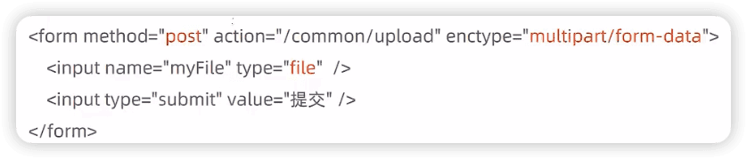
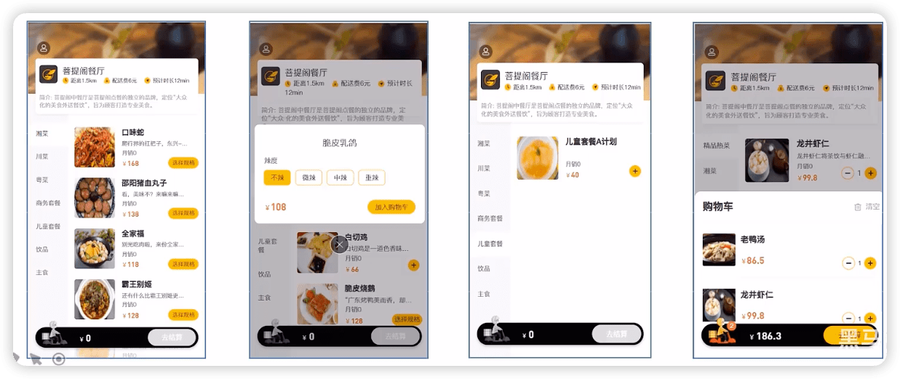

外卖
------

https://www.bilibili.com/video/BV13a411q753


## 软件开发整体介绍

### 软件开发流程


### 角色分工

- 项目经理：对整个项目负责，任务分配、把控进度

- 产品经理：进行需求调研，输出需求调研文档、产品原型等

- UI设计师：根据产品原型输出界面效果图

- 架构师：项目整体架构设计、技术选型等

- 开发工程师：代码实现

- 测试工程师：编写测试用例，输出测试报告

- 运维工程师：软件环境搭建、项目上线

### 软件环境

- 开发环境(development)：开发人员在开发阶段使用的环境，一般外部用户无法访问

- 测试环境(testing)：专门给测试人员使用的环境，用于测试项目，一般外部用户无法访问

- 生产环境(production)：即线上环境，正式提供对外服务的环境

## 项目介绍

### 介绍

本项目是专门为餐饮企业(餐厅、饭店）定制的一款软件产品，包括系统管理后台和移动端应用两部分。

其中系统管理后台主要提供给餐饮企业内部员工使用，可以对餐厅的菜品、套餐、订单等进行管理维护。移动端应用

主要提供给消费者使用，可以在线浏览菜品、添加购物车、下单等。

本项目共分为3期进行开发：

第一期主要实现基本需求，其中移动端应用通过H5实现，用户可以通过手机浏览器访问。

第二期主要针对移动端应用进行改进，使用微信小程序实现，用户使用起来更加方便。

第三期主要针对系统进行优化升级，提高系统的访问性能。

### 产品原型

产品原型，就是一款产品成型之前的一个简单的框架，就是將页面的排版布局展现出来，使产品的初步构思有一个可视化的展示。通过原型展示，可以更加直观的了解项目的需求和提供的功能。

产品原型主要用于展示项目的功能，并不是最终的页面效果。

### 技术选型


### 功能架构


### 角色

- 后台系统管理员：登录后台管理系统，拥有后台系统中的所有操作板限
- 后台系统普通员工：登录后台管理系统，对菜品、套餐、订单等进行管理
- C端用户：登录移动端应用，可以浏览菜品、添加购物车、设置地址、在线下单等


## 开发环境搭建

### 数据库

数据表


项目名：artakeout


## 后台登录、退出

admin

123456


```js
this.$refs.loginForm.validate(async (valid) => {
  if (valid) {
    this.loading = true
    let res = await loginApi(this.loginForm)
    if (String(res.code) === '1') {
      localStorage.setItem('userInfo',JSON.stringify(res.data))
      window.location.href= '/backend/index.html'
    } else {
      this.$message.error(res.msg)
      this.loading = false
    }
  }
})
```


### 完善登录

还存在一个问题：用户如果不登录，直接访问系统首页面，照样可以正常访问。

这种设计并不合理，我们希望看到的效果应该是，只有登录成功后才可以访问系统中的页面，如果没有登录则跳转到登录页面。

那么，具体应该怎么实现呢？

答案就是使用**==过滤器或者拦截器==**，在过滤器或者拦截器中判断用户是否已经完成登录，如果没有登录则跳转到登录页面。

#### 实现步骤

1. 创建自定义过滤器`LoginCheckFiltter`
2. 在启动类上加入注解`@Servletcomponentscan`
3. 完善过滤器的处理逻辑

过滤器具体的处理逻辑如下：

1. 获取本次请求的URI
2. 判断本次请求是否需要处理
3. 如果不需要处理，则直接放行
4. 判断登录状态，如果已登录，则直接放行
5. 如果未登录则返回未登录结果


🔖 p18 浏览器js调试

## 员工管理

### 新增员工

employee表中对username字段加入了唯一约束，因为username是员工的登录账号，必须是唯一的。

梳理一下整个程序的执行过程：

1. 页面发送司ajax请求，将新增员工页面中输入的数据以json的形式提交到服务端
2. 服务端Controller接收页面提交的数据并调用Service将数据进行保存

3、service调用Mapper操作数据库，保存数据


前面的程序还存在一个问题，就是当我们在新增员工时输入的账号已经存在，由于employee表中对该宇段加入了唯一约束，此时程序会抛出异常：

```java
java.sql.SQLIntegrityConstraintViolationException: Duplicate entry ' zhangsan' for key ' idx_username
```

此时需要我们的程序进行异常捕获，通常有两种处理方式：

1. 在Controller方法中加入try、catch进行异常捕获

```java
try {
  employeeService.save(employeee);
} catch (Exception e) {
  R.error("新增员工失败");
}
return R.Success("新增员工成功");
```

2. 使用异常处理器进行全局异常捕获


#### 小结

1. 根据产品原型明确业务需求
2. 重点分析数据的流转过程和数据格式
3. 通过debug断点调试跟踪程序执行过程


### 员工信息分页查询

梳理一下整个程序的执行过程：

1. 页面发送ajax请求，将分页查询参数(page、pageSize、name)提交到服务端
2. 服务端Controller接收页面提交的数据并调用Service查询数据

3、Service调用Mapper操作数据库，查询分页数据

4、Controller将查询到的分页数据响应给页面

5、页面接收到分页数据并通过Elementul的Table组件展示到页面上


### 启用/禁用员工账号

#### 需求分析

在员工管理列表页面，可以对某个员工账号进行启用或者禁用操作。账号禁用的员工不能登录系统，启用后的员工可以正常登录。

需要注意，只有管理员 (admin用户）可以对其他普通用户进行启用、禁用操作，所以普通用户登录系统后启用、禁用按钮不显示。


#### 功能测试

测试过程中没有报错，但是功能并没有实现，查看数据库中的数据也没有变化。

观察控制台输出的SQL：


SQL执行的结果是更新的数据行数为0，仔细观察id的值，和数据库中对应记录的id值并不相同：


#### 代码修复

前面我们已经发现了问题的原因，即js对long型数据进行处理时丢失精度，导致提交的id和数据库中的id不一致。

如何解决这个问题？

我们可以在服务端给页面响应json数据时进行处理，将long型数据统一转为String字符串，效果如下：


具体实现步骤：

1. 提供对象转换器JacksonObjectMapper，基于jackson进行ava对象到ison数据的转换（资料中已经提供，直接复制到项目中使用）

2. 在WebMvcConfig配置类中扩展Spring mvc的消息转换器，在此消息转换器中使用提供的对象转换器进行ava对象到jison数据的转换

```java
@Configuration
public class WebMvcConfig extends WebMvcConfigurationSupport {
    /**
     * 扩展MVC框架的消息转换器
     * @param converters
     */
    @Override
    protected void extendMessageConverters(List<HttpMessageConverter<?>> converters) {
        log.info("扩展消息转换器....");
        // 创建消息转换器对象
        MappingJackson2HttpMessageConverter messageConverter = new MappingJackson2HttpMessageConverter();
        // 设置对象转换器，底层使用Jackson将Java对象转为json
        messageConverter.setObjectMapper(new JacksonObjectMapper());
        // 将消息转换器对象追加到mvc框架的转换器集合中（放在第一位）
        converters.add(0, messageConverter);
    }
}
```


### 编辑员工信息

梳理一下操作过程和对应的程序的执行流程：

1. 点击编辑按钮时，页面跳转到add.html，并在url中携带参数[员工id]
2. 在add.htm页面获取url中的参数[员工id]

3. 发送ajax请求，请求服务端，同时提交员工id参数
4. 服务端接收请求，根据员工id查询员工信息，将员工信息以json形式响应给页面
5. 页面接收服务端响应的json数据，通过VUE的数据绑定进行员工信息回显
6. 点击保存按钮，发送ajax请求，将页面中的员工信息以json方式提交给服务端
7. 服务端接收员工信息，并进行处理，完成后给页面响应
8. 页面接收到服务端响应信息后进行相应处理

> 注意：add.html页面为公共页面，新增员工和编辑员工都是在此页面操作

## 分类管理

### 公共字段自动填充

#### 问题分析

前面我们已经完成了后台系统的员工管理功能开发，在新增员工时需要设置创建时问、创建人、修改时问、修改人等字段，在编辑员工时需要设置修改时问和修改人等宇段。这些字段属于公共字段，也就是很多表中都有这些字段。


使用Mybatis Plus提供的公共字段自动填充功能，来对于这些公共字段在某个地方统一处理，来简化开发。

#### 代码实现

Mybatis Plus公共字段自动填充，也就是在插入或者更新的时候为指定字段赋予指定的值，使用它的好处就是可以统一对这些字段进行处理，避免了重复代码。

实现步骤：

1. 在实体类的属性 上加入`@TableField`注解，指定自动填充的策略

2. 按照框架要求编写元数据对象处理器，在此类中统一为公共字段赋值，此类需要实现`MetaObjectHandler`接口


#### 功能完善

前面我们已经完成了公共字段自动填充功能的代码开发，但是还有一个问题没有解决，就是我们在自动填充createUser和updateuser时设置的用户id是固定值，现在我们需要改造成动态获取当前登录用户的id。

有的同学可能想到，用户登录成功后我们将用户id存入了HttpSession中，现在我从Httpsession中获取不就行了？

注意，我们在MyMetaObjectHandler类中是不能获得HttpSession对象的，所以我们需要通过其他方式来获取登录用户id。

可以使用ThreadLocal来解决此问题，它是JDK中提供的一个类。


在学习Threadlocal之前，我们需要先确认一个事情，就是客户端发送的每次http请求，对应的在服务端都会分配一个新的线程来处理，在处理过程中涉及到下面类中的方法都属于相同的一个线程：

1. LoginCheckFilter的doFilter方法

2. EmployeeController的update方法

3. MyMetaObjectHandler的updateFill方法

可以在上面的三个方法中分别加入下面代码(获取当前线程id）：

```java
log.info("线程id：{}", Thread.currentThread().getId());
```

执行编辑员工功能进行验证，通过观察控制台输出可以发现，一次请求对应的线程id是相同的。


##### 什么是ThreadLocal?

ThreadLocal并不是一个Thread，而是==Thread的局部变量==。当使用ThreadLocal维护变量时，ThreadLocal为每个使用该变量的线程提供独立的变量副本，所以每一个线程都可以独立地改变自己的副本，而不会影响其它线程所对应的副本。

ThreadLocal 为每个线程提供单独一份存储空间，具有**线程隔离**的效果，只有在线程内才能获取到对应的值，线程外则不能访问。

ThreadLocal常用方法：

- `public void set(T value）` 设置当前线程的线程局部变量的值
- `public T get()`  返回当前线程所对应的线程局部变量的值

我们可以在LoginCheckFilter的doFilter方法中获取当前登录用户id，并调用ThreadLocal的set方法来设置当前线程的线程局部变量的值（用户id），然后在MyMetaObjectHandler的updateFill方法中调用ThreadLocal的get方法来获得当前线程所对应的线程局部变量的值（用户id）。

##### 实现步骤：

1. 编写BaseContext工具类，基于ThreadLocal封装的工具类
2. 在LoginCheckFilter的doFilter方法中调用BaseContext来设置当前登录用户的id
3. 在MyMetaObjectHandler的方法中调用BaseContext获取登录用户的id


### 新增分类

后台系统中可以管理分类信息，分类包括两种类型，分别是菜品分类和套餐分类。当我们在后台系统中添加菜品时需要选择一个菜品分类，当我们在后台系统中添加一个套餐时需要选择一个套餐分类，在移动端也会按照菜品分类和套餐分类来展示对应的菜品和套餐。

在开发业务功能前，先将需要用到的类和接口基本结构创建好：

- 实体类Category
- Mapper接口 CategoryMapper
- 业务层接口 Categoryservice
- 业务层实现类Category Servicelmpl
- 控制层Categorycontroler

梳理一下整个程序的执行过程：

1. 页面(backend/page/category/list.html)发送ajax清求，将新増分类窗口输入的数据以json形式提交到服多端
2. 服务端Controller接收页面提交的数据并调用Service将数据进行保存

3. Service凋用Mapper操作数据库，保存数据

可以看到新增菜品分类和新增套餐分类请求的服务端地址和提交的json数据结构相同，所以服务端只需要提供一个方法统一处理即可。

### 分类信息分析查询


### 删除分类


要完善分类删除功能，需要先准备基础的类和接口：

1. 实体类Dish和Setmeal
2. Mapper接口DishMapper和 SetmealMapper
3. Service接口DishService和 Setmealservice
4. Service实现类 DishServicelmpl和SetmealServicelmpl


🔖 后面调试部分


### 修改分类


## 菜品管理

🔖 起售、停售


### 文件上传下载

#### 文件上传介绍

文件上传，也称为upload，是指将本地图片、视频、音频等文件 上传到服务器上，可以供其他用户浏览或下载的过程。

文件上传在项目中应用非常广泛，我们经常发微博、发微信朋友圈都用到了文件上传功能。

文件上传时，对页面的form表单有如下要求：

-  method="post"  采用post方式提交数据

- enctype="multipart/form-data"   采用multipart格式上传文件
- type="file"  使用input的file控件上传



服务端要接收客户端页面上传的文件，通常都会使用Apache的两个组件：

- commons-fileupload
- commons-io

Spring框架在Spring-web包中对文件上传进行了封装，大大简化了服务端代码，我们只需要在Controller的方法中声明一个`MultipartFile`类型的参数即可接收上传的文件。

#### 文件下载介绍

文件下载，也称为download，是指将文件从服务器传输到本地计算机的过程。

通过浏览器进行文件下载，通常有两种表现形式：

- 以附件形式下载，弹出保存对话框，将文件保存到指定磁盘目录
- 直接在浏览器中打开

通过浏览器进行文件下载，本质上就是服务端将文件以流的形式写回浏览器的过程。


### 新增菜品

新增菜品，其实就是将新增页面录入的菜品信息插入到dish表，如果添加了口味做法，还需要向dish_ flavor表插入数据。

所以在新增菜品时，涉及到两个表：

- dish菜品表

- dish flavor 菜品口味表

在开发业务功能前，先将需要用到的类和接口基本结构创建好：

- 实体类 DishFlavor
- Mapper接口 DishFlavorMapper
- 业务层接口 DishFlavorService
- 业务层实现类 DishFlavorservicelmpl
- 控制层 DishController

梳理一下新增菜品时前端页面和服务端的交互过程：

1. 页面(backend/ page/food/add.html)发送ajax请求，请求服务端获取菜品分类数据并展示到下拉框中
2. 页面发送请求进行图片上传，请求服务端将图片保存到服务器
3. 页面发送请求进行圈片下载，將上传的图片进行回显
4. 点击保存按钮，发送司jax请求，将菜品相关数据以json形式提交到服务端

开发新增菜品功能，其实就是在服务端编写代码去处理前端页面发送的这4次请求即可。


#### 代码开发DTO

DTO，全称为Data Transfer object，即数据传输对象，一般用于展示层与服务层之问的数据传输。

DishDto用于封装页面提交的数据：

```java
@Data
public class DishDto extends Dish {
    private List<DishFlavor> flavors = new ArrayList<>();
    private String categoryName;
    private Integer copies;
}
```


```json
{
    "name": "xxx",
    "price": 2000,
    "code": "",
    "image": "452743c7-0270-4db2-86b3-4a6ccc498444.jpg",
    "description": "打卡积分时代峰峻阿萨德飞机阿萨",
    "status": 1,
    "categoryId": "1397844303408574465",
    "flavors": [
        {
            "name": "温度",
            "value": "[\"热饮\",\"常温\",\"去冰\",\"少冰\",\"多冰\"]",
            "showOption": false
        },
        {
            "name": "忌口",
            "value": "[\"不要葱\",\"不要蒜\",\"不要香菜\",\"不要辣\"]",
            "showOption": false
        },
        {
            "name": "温度",
            "value": "[\"热饮\",\"常温\",\"去冰\",\"少冰\",\"多冰\"]",
            "showOption": false
        },
        {
            "name": "辣度",
            "value": "[\"不辣\",\"微辣\",\"中辣\",\"重辣\"]",
            "showOption": false
        }
    ]
}
```


### 菜品信息分页查询

🔖  一个页面好多请求，影响效率吗？怎么改进


### 修改菜品

梳理一下修改菜品时前端页面（add.html）和服务端的交互过程：

1. 页面发送ajax请求，请求服务端获取分类数据，用于菜品分类下拉框中数据展示
2. 页面发送ajax请求，请求服务端，根据id查询当前菜品信息，用于菜品信息回显
3. 页面发送请求，请求服务端进行图片下载，用于页图片回显
4. 点击保存按钮，页面发送ajax请求，将修改后的菜品相关数据以son形式提交到服务端

开发修改菜品功能，其实就是在服务端编写代码去处理前端页面发送的这4次请求即可。


## 套餐管理

🔖 修改 停售 启售

### 新增套餐

#### 需求分析

套餐就是菜品的集合。

后台系统中可以管理套餐信息，通过新增套餐功能来添加一个新的套餐，在添加套餐时需要选择当前套餐所属的套餐分类和包含的菜品，并且需要上传套餐对应的图片，在移动端会按照套餐分类来展示对应的套餐。


#### 数据模型

新增套餐，其实就是将新增页面录入的套餐信息插入到setmeal表，还需要向setmeal_dish表插入套餐和菜品关联数据。

所以在新增套餐时，涉及到两个表：

- setmeal  套餐表

- setmeal_dish  套餐菜品关系表

#### 代码开发

基本类和接口基本结构创建好：

- 实体类 SetmealDish
- DTO SetmealDto
- Mapper接口 SetmealDishMapper
- 业务层接口 SetmealDishservice
- 业务层实现类 SetmealDishServicelmpl
- 控制层 Setmealcontroller

梳理一下新增套餐时前端页面和服务端的交互过程：

1. 页面(backend/page/combo/add.html)发送ajax请求，请求服务端获取套餐分类数据并展示到下拉框中
2. 页面发送ajax请求，请求服务端获取菜品分类数据并展示到添加菜品窗口中
3. 页面发送ajax请求，请求服务端，根据菜品分类查询对应的菜品数据并展示到添加菜品窗口中
4. 页面发送请求进行国片上传，请求服务端将图片保存到服务器
5. 页面发送请求进行图片下载，将上传的图片进行回显
6. 点击保存按钮，发送ajax请求，将套餐相关数据以json形式提交到服务端

开发新增套餐功能，其实就是在服务端编写代码去处理前端页面发送的这6次请求即可。


### 套餐信息分页查询


### 删除套餐

在套餐管理列表页面点击删除按钮，可以删除对应的套餐信息。也可以通过复选框选择多个套餐，点击批量删除按钮一次删除多个套餐。注意，<u>对于状态为售卖中的套餐不能删除，需要先停售，然后才能删除。</u>

梳理一下删除套餐时前端页面和服务端的交互过程：

1. 删除单个套餐时，页面发送aiax请求，根据套餐id删除对应套餐

   ```
   http://localhost:8080/setmeal?ids=1641895881319911426
   ```

2. 删除多个套餐时，页面发送ajax请求，根据提交的多个套餐id删除对应套餐

   ```
   http://localhost:8080/setmeal?ids=1641895881319911426,1641894824430817282,1641894421857325058
   ```

开发删除套餐功能，其实就是在服务端编写代码去处理前端页面发送的这2次请求即可。

删除单个套餐和批量删除套餐请求的地址和请求方式都是相同的，不同的则是传递的id个数，所以在服务端可以提供一个方法来统一处理。


## 手机验证码登录

### 短信发送

#### 短信服务介绍

目前市面上有很多第三方提供的短信服务，这些第三方短信服务会和各个运营商 （移动、联通、电信）对接，我们只需要注册成为会员并且按照提供的开发文档进行调用就可以发送短信。需要说明的是，这些短信服务一般都是收费服务。

常用短信服务：

- 阿里云

- 华为云

- 腾讯云
- 京东
- 梦网
- 乐信

#### 阿里云短信服务介绍

阿里云短信服务(Short Message Service，==SMS==）是广大企业客户快速触达手机用户所优选使用的通信能力。调用API或用群发助手，即可发送验证码、通知类和营销类短信；国内验证短信秘级触达，到达率最高可达99%；国际/港澳台短信覆盖200多个国家和地区，安全稳定，广受出海企业选用。

应用场景：

- 验证码。

- 短信通知
- 推广短信

https://www.aliyun.com/product/sms

🔖P82 阿里云控制台的一些操作


设置短信签名

短信签名是短信发送者的署名，表示发送方的身份。


设置短信模版


```xml
	<!-- 阿里云SMS -->
    <dependency>
      <groupId>com.aliyun</groupId>
      <artifactId>aliyun-java-sdk-core</artifactId>
      <version>4.5.16</version>
    </dependency>
    <dependency>
      <groupId>com.aliyun</groupId>
      <artifactId>aliyun-java-sdk-dysmsapi</artifactId>
      <version>2.1.0</version>
    </dependency>
```


### 开发

#### 需求分析

为了方便用户登录，移动端通常都会提供通过手机验证码登录的功能。

手机验证码登录的优点：

- 方便快捷，无需注册，直接登录
- 使用短信验证码作为登录凭证，无需记忆密码

- 安全

登录流程：

```
输入手机号>获取验证码>输入验证码>点击登录>登录成功
```

注意：通过手机验证码登录，手机号是区分不同用户的标识。


梳理一下登录时前端页面和服务端的交互过程：

1. 在登录页面(front/page/login.html)输入手机号，点击【获取验证码】按钮，页面发送司jax请求，在服务端调用短信服务API给指定手机号发送验证码短信

2. 在登录页面输入验证码，点击【登录】按钮，发送司jax请求，在服务端处理登录请求

开发手机验证码登录功能，其实就是在服务端编马代码去处理前端页面发送的这2次请求即可。


🔖 阿里sms 的key

## 菜品展示、购物车、下单

导入用户地址簿相关功能

### 菜品展示

#### 需求分析

用户登录成功后跳转到系统首页，在首页需要根据分类来展示菜品和套餐。如果菜品设置了口味信息，需要展示 **选择观格** 按钮，否则显示 **+**按钮。


梳理一下前端页面和服务端的交互过程：

1. 页面(front/index.html)发送司jax请求，获取分类数据（菜品分类和套餐分类）

2. 页面发送ajax请求，获取第一个分类下的菜品或者套餐

开发菜品展示功能，其实就是在服务端编写代码去处理前端页面发送的这2次请求即可。


### 购物车

#### 需求分析

移动端用户可以将菜品或者套餐添加到购物车。对于菜品来说，如果设置了口味信息，则需要选择规格后才能加入购物车;对于套餐来说，可以直接点击 + 将当前套餐加入购物车。在购物车中可以修改菜品和套餐的数量，也可以清空购物车。




梳理一下购物车操作时前端页面和服务端的交互过程：

1. 点击【加入购物车】或者 + 按钮，页面发送司jax请求，请求服务端，将菜品或者套餐添加到购物车

2. 点击购物车图标，页面发送ajax请求，请求服务端查询购物车中的莱品和套餐

3. 点击清空购物车按钮，页面发送ajax请求，请求服务端来执行清空购物车操作

### 用户下单

梳理一下用户下单操作时前端页面和服务端的交互过程：

1. 在购物车中点击【去结算】 按钮，页面跳转到订单确认页面
2. 在订单确认页面，发送ajax请求，请求服务端获取当前登录用户的默认地址
3. 在订单确认页面，发送ajax请求，请求服务端获取当前登录用户的购物车数据
4. 在订单确认页面点击【去支付】按钮，发送司jax请求，请求服务端完成下单操作


## Git

## Linux 

### 项目部署

#### 手工部署项目

#### 通过shell脚本自动部署项目


## 缓存优化

### 缓存环境搭建


### 缓存短信验证码

#### 实现思路

前面我们己经实现了移动端手机验证码登录，随机生成的验证码我们是保存在HttpSession中的。

现在需要改造为將验证码缓存在Redis中，具体的实现思路如下：

1. 在服务端Usercontroller中注入RedisTemplate对象，用于操作Redis
2. 在服务端UserController的sencMsg方法中，将随机生成的验证码缓存到Redis中，并设置有效期为5分钟
3. 在服务端Usercontroller的login方法中，从Redis中获取缓存的验证码，如果登录成功则删除Redis中的验证码

```java
            // 验证码保存到session
//            session.setAttribute(phone, code);
            // 验证保存到Redis，设置有效期5min
            redisTemplate.opsForValue().set(phone, code, 5, TimeUnit.MINUTES);
```

```java
        // 从session中获取保存的验证码
//        Object codeInSession = session.getAttribute(phone);
        // 从Redis获取缓存的验证码
        Object codeInSession = redisTemplate.opsForValue().get(phone);
```

```java
            // 用户登录成功，删除Redis中缓存的验证码
            redisTemplate.delete(phone);
```


### 缓存菜品数据

#### 实现思路

前面我们已经实现了移动端菜品查看功能，对应的服务端方法为DishController的list方法，此方法会根据前端提交的查询条件进行数据库查询操作。在高并发的情况下，频繁查询数据库会导致系统性能下降，服务端响应时间增长。现在需要对此方法进行缓存优化，提高系统的性能。

具体的实现思路如下：

1. 改造Dishcontroller的list方法，先从Redis中获取菜品数据，如果有则直接返回，无需查询数据库;如果没有则查询数据库，并将查询到的菜品数据放入Redis。
2. 改造Dishcontroller的save 和update方法，加入清理缓存的逻辑

> 注意：在使用缓存过程中，要注意**保证数据库中的数据和缓存中的数据一致**，如果数据库中的数据发生变化，需要及时清理缓存数据。

```java
// 动态构造Redis的key
String key = "dish_" + dish.getCategoryId() + "_" + dish.getStatus();
dishDtoList = (List<DishDto>) redisTemplate.opsForValue().get(key);
if (dishDtoList != null) {
  // 缓存中存在，就直接返回，不用查数据库
  return R.success(dishDtoList);
}

// ...

// 查询的心数据做缓存
redisTemplate.opsForValue().set(key, dishDtoList, 60, TimeUnit.MINUTES);

```


```java
// 清理对应分类下的菜品缓存数据
String key = "dish_" + dishDto.getCategoryId() + "_1";
redisTemplate.delete(key);
```


> 🔖 问题合集
>
> - idea 断点调试时，下一步需要等待 The application is running
> - Java 接口 public是否可以省略
> - 没有支付功能
> - 后端登录后，前端不要再登录


